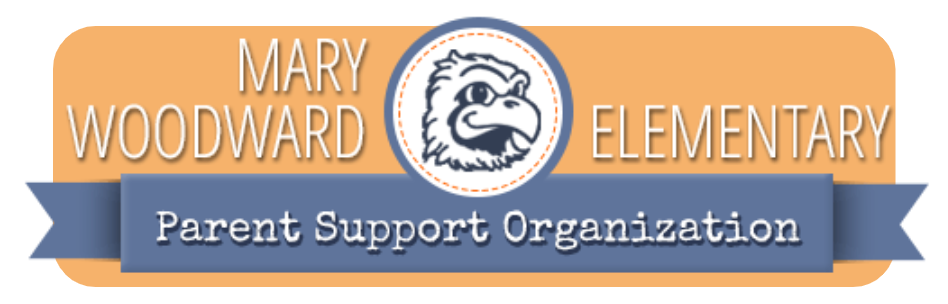

# PSO School Calendar

A modern, user-friendly web application that displays a customized school calendar for the PSO (Parent-Student Organization) website. This application automatically fetches and displays events from a public Google Calendar feed.

## Features

- **Easy-to-read Calendar**: View the entire school year at a glance with a clean, intuitive interface
- **Month-by-Month View**: See events organized by month for better planning
- **PDF Export**: Generate a printable PDF of the calendar with a single click
- **Automatic Updates**: Calendar stays in sync with your Google Calendar events
- **Mobile-Friendly**: Works on all devices from smartphones to desktops

## Getting Started (For Administrators)

### Prerequisites

- A public Google Calendar with your school events
- Basic familiarity with web hosting or a Vercel account

### Setup Instructions

1. **Create your public Google Calendar feed:**
   - In Google Calendar, go to your calendar settings
   - Under "Access permissions for events," select "Make available to public"
   - Copy the public iCal URL (look for "Secret address in iCal format")

2. **Set up the environment:**
   - Copy the `.env.sample` file and rename it to `.env`
   - Replace the `PUBLIC_CALENDAR_URL` value with your Google Calendar's public URL
   - Make sure your URL ends with `?ctz=America%2FLos_Angeles` for correct timezone handling

3. **Run the application:**
   - For development: `pnpm dev`
   - For production: `pnpm build` followed by `pnpm start`

## Usage Guide

Once set up, the calendar will automatically display all events from your Google Calendar for the current school year. The school year is calculated to start on August 1st.

- **Viewing Events**: Events are displayed on both a calendar grid and in a list format
- **Printing Calendar**: Click the printer icon to generate and download a PDF version
- **Updating Events**: Any changes made to your Google Calendar will automatically reflect in the application

## Support

For questions or assistance, please contact your website administrator.

## Privacy Note

This application only displays events from a public Google Calendar. No personal information is collected or stored.
